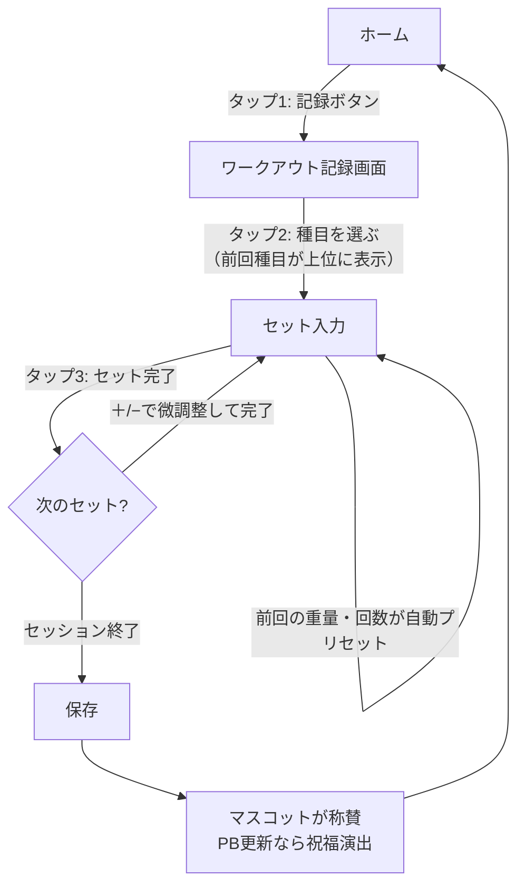
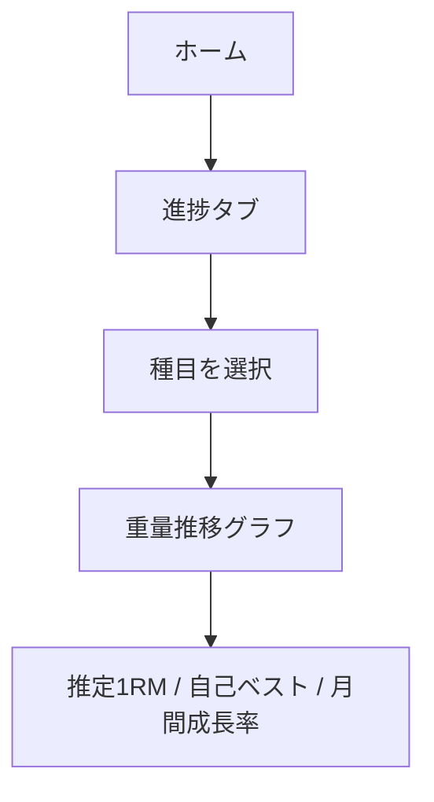
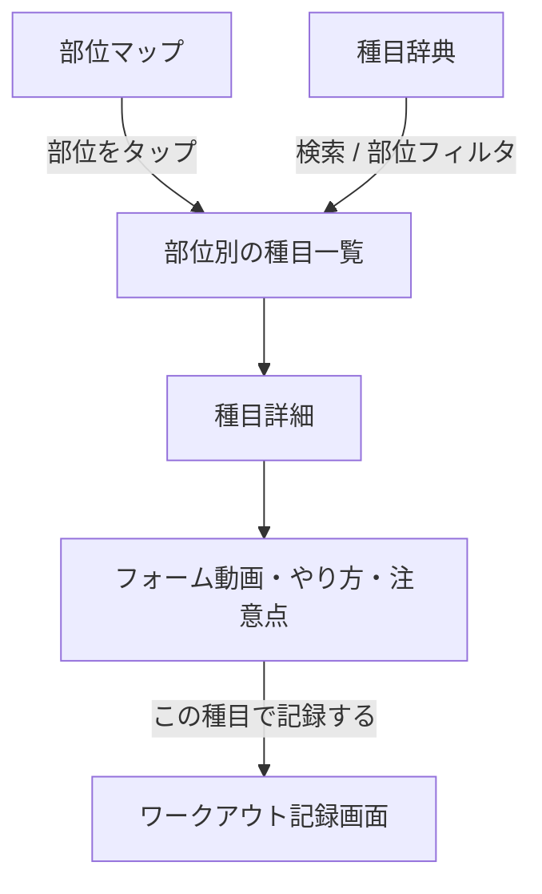
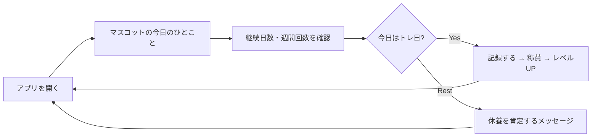

# 03. ユーザーフロー

## フロー1: トレーニング記録（最重要・3タップ設計）

**ポイント**
- 種目選択リストは「最近使った順」でソート → 常連種目は1タップ目に出る
- セット入力は前回値プリセット + ステッパー → キーボード不要
- 自己ベスト更新はセット完了時に即時判定・即時祝福

## フロー2: 成長を実感する

## フロー3: 種目を学ぶ

## フロー4: 毎日の習慣ループ（継続の核）

## フロー5（将来）: SNSループ

チェックイン → 記録 → 自動生成サマリーを投稿 → いいね/コメント → 通知で再訪
