# 04. ER図

論理モデル（正規化済み）。物理実装は Firestore（ドキュメント指向）だが、
論理設計はRDB同様に正規化し、コレクション設計（05）でFirestore向けに写像する。

```mermaid
erDiagram
    USERS ||--o{ WORKOUT_LOGS : "記録する"
    USERS ||--o{ RECORDS : "保持する"
    USERS ||--o{ USER_ACHIEVEMENTS : "獲得する"
    USERS ||--o{ WORKOUT_TEMPLATES : "作成する"
    USERS ||--o{ CHECKINS : "行う"
    USERS ||--o{ POSTS : "投稿する"
    USERS ||--o{ COMMENTS : "書く"
    USERS ||--o{ LIKES : "押す"
    USERS ||--o{ NOTIFICATIONS : "受け取る"
    USERS ||--o{ FOLLOWS : "フォローする"

    EXERCISE_CATEGORIES ||--o{ EXERCISES : "分類する"
    EXERCISES ||--o{ WORKOUT_SETS : "使われる"
    EXERCISES ||--o{ RECORDS : "対象になる"

    WORKOUT_LOGS ||--o{ WORKOUT_SETS : "含む"
    WORKOUT_TEMPLATES ||--o{ TEMPLATE_EXERCISES : "含む"
    EXERCISES ||--o{ TEMPLATE_EXERCISES : "参照される"

    ACHIEVEMENTS ||--o{ USER_ACHIEVEMENTS : "定義する"
    MASCOT_MESSAGES }o--|| MESSAGE_CONTEXTS : "文脈を持つ"

    GYMS ||--o{ CHECKINS : "場所になる"
    POSTS ||--o{ COMMENTS : "付く"
    POSTS ||--o{ LIKES : "付く"

    USERS {
        string id PK
        string displayName
        string avatarUrl
        int level
        int xp
        int currentStreak
        int longestStreak
        timestamp createdAt
    }

    EXERCISE_CATEGORIES {
        string id PK "chest / back / shoulders / legs / arms / core"
        string nameJa
        int sortOrder
    }

    EXERCISES {
        string id PK
        string categoryId FK
        string nameJa
        string nameEn
        string youtubeUrl
        string[] targetMuscles
        string[] howTo
        string[] cautions
        string[] beginnerTips
        string[] commonMistakes
        string equipment "barbell/dumbbell/machine/bodyweight/cable"
        bool isCustom "ユーザー追加種目"
    }

    WORKOUT_LOGS {
        string id PK
        string userId FK
        date date
        string note
        int durationMinutes
        timestamp createdAt
    }

    WORKOUT_SETS {
        string id PK
        string workoutLogId FK
        string exerciseId FK
        int setNumber
        float weightKg
        int reps
        float rpe "6.0-10.0 任意"
        timestamp completedAt
    }

    RECORDS {
        string id PK
        string userId FK
        string exerciseId FK
        string type "max_weight / est_1rm / max_reps / max_volume"
        float value
        date achievedAt
    }

    WORKOUT_TEMPLATES {
        string id PK
        string userId FK
        string name
    }

    TEMPLATE_EXERCISES {
        string id PK
        string templateId FK
        string exerciseId FK
        int targetSets
        int sortOrder
    }

    ACHIEVEMENTS {
        string id PK
        string title
        string description
        string iconKey
        string conditionType "streak/total_workouts/pb_count/..."
        int conditionValue
    }

    USER_ACHIEVEMENTS {
        string userId FK
        string achievementId FK
        timestamp unlockedAt
    }

    MASCOT_MESSAGES {
        string id PK
        string context "greeting/encourage/praise/pb_celebration/rest_day/streak"
        string text
        int weight "出現率の重み"
    }

    GYMS {
        string id PK
        string name
        geopoint location
    }

    CHECKINS {
        string id PK
        string userId FK
        string gymId FK
        timestamp checkedInAt
    }

    POSTS {
        string id PK
        string userId FK
        string workoutLogId FK "任意: 記録の共有"
        string body
        string[] mediaUrls
        int likeCount
        int commentCount
        timestamp createdAt
    }

    COMMENTS {
        string id PK
        string postId FK
        string userId FK
        string body
        timestamp createdAt
    }

    LIKES {
        string postId FK
        string userId FK
        timestamp createdAt
    }

    FOLLOWS {
        string followerId FK
        string followeeId FK
        timestamp createdAt
    }

    NOTIFICATIONS {
        string id PK
        string userId FK
        string type "like/comment/follow/achievement/reminder"
        string payload "JSON"
        bool isRead
        timestamp createdAt
    }
```

## 設計判断

- **WorkoutSets を WorkoutLogs から分離**: セット単位の分析（1RM推移・ボリューム集計）を可能にする
- **Records を独立テーブル化**: PB判定を O(1) 参照にし、祝福演出・PB一覧を高速化（記録保存時に更新）
- **Exercises はマスタ + ユーザー拡張**: `isCustom` でシード種目とユーザー種目を同居
- **SNS/ゲーミフィケーション系**は将来テーブルとして定義のみ。MVPでは未実装
